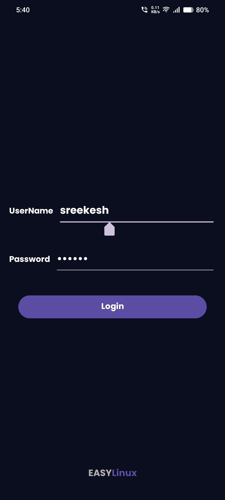

# EasyLinux

**EasyLinux** is an Android app designed to help you learn basic Linux commands. Built using Android Studio, this app provides an easy and interactive way to get familiar with the Linux command line.

## Features

- **User-Friendly Interface**: Navigate through a simple and intuitive interface to explore Linux commands.
- **Command Search**: Quickly find information about various Linux commands using the search functionality.
- **Detailed Command Descriptions**: View detailed explanations and usage examples for each command.
- **Favorites**: Mark your frequently used commands as favorites for quick access.

## Screenshots

Here's a glimpse of what you can expect from EasyLinux:

| Home Screen | Login Screen |
|-------------|--------------|
|  |  |

| Menu Screen | Search Screen |
|-------------|---------------|
|  |  |

| Command Details Screen | Favorites Screen |
|------------------------|------------------|
|  |  |

## Installation

1. Clone the repository:
    ```bash
    git clone https://github.com/sreekesh-k/EasyLinux.git
    ```
2. Open the project in Android Studio.
3. Build and run the project on your Android device or emulator.

## Usage

- **Explore Commands**: Use the menu to browse through various Linux commands.
- **Search for Commands**: Enter keywords in the search bar to find specific commands.
- **View Details**: Tap on any command to see detailed information and usage examples.
- **Add to Favorites**: Mark commands as favorites to easily access them later.

## Contributing

Contributions are welcome! If you have suggestions or improvements, please open an issue or submit a pull request.
